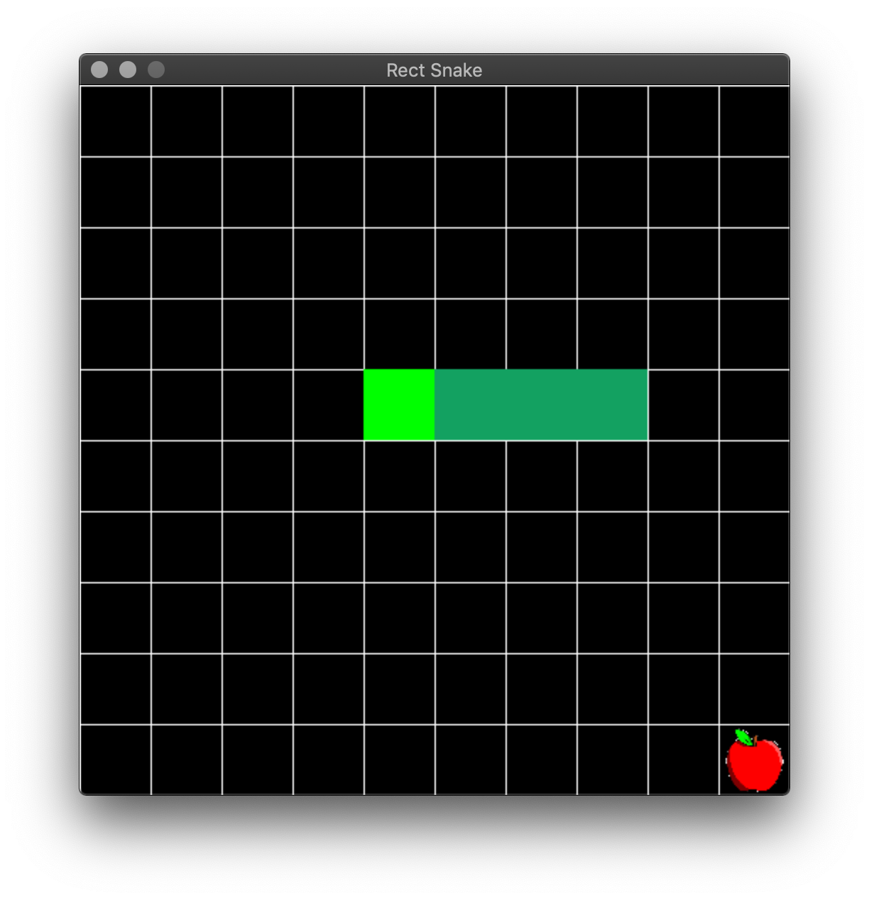
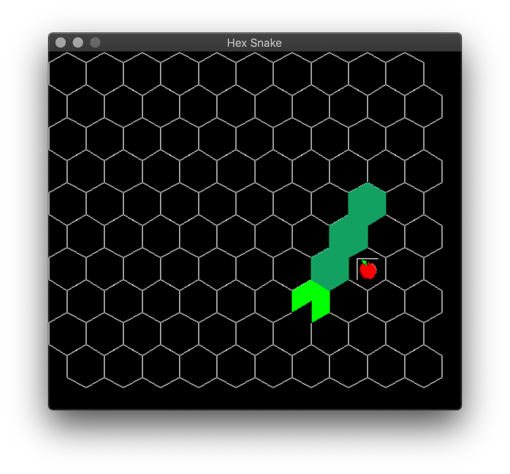

# snake :snake:

This is a toy project that implements the classic game snake using the PyGame module

# Running the code
## Rectangular snake


Make sure you are in the project folder and then run:
```
pipenv run python3 game/rect_snake.py
```
an interactive window will pop-up and you can use the arrow keys (up,down,right,left) to control the snake. 


## Hex snake


Make sure you are in the project folder and then run:
```
pipenv run python3 game/hex_snake.py
```
an interactive window will pop-up and you can use the following keys to control the snake:
* <kbd>a</kbd> - left
* <kbd>w</kbd> - up-left
* <kbd>e</kbd> - up-right
* <kbd>d</kbd> - right
* <kbd>x</kbd> - down right
* <kbd>z</kbd> - down left


## More ideas for extension:
* snake with bridges/tunnels? (2.5 dimensional snake)
